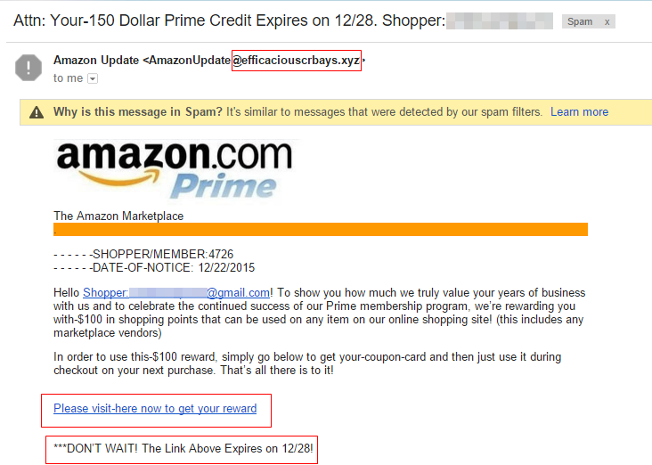

Clone Sites
===========

Clone sites at first glace look tike the real site 
but they are not. the scamers make a clone site that 
looks like the real sites. the most common wasys the
scam is conducted is by making fake websites that 
look reputable, such as clone banks, government tax
websites, pension firms, passport sites, fake 
driving tests, travel companies and fake retailers 
pretending to be reputable online retailers like
ebey and amazon. [#f1]_

How it works
------------

the clone stes have a problem getting people to click
on their sites because they are a coppy however they
get people to click by sendig an email claiming that 
there is unknown activity on the victims bank acount
and then they provide a link for the victim to check
to make sure everything is okay. the like then takes
the victim to the cloned cite. when the victim logs
in, the acamers will have their bamking information 
which they can use to steal money.[#f3]_

    An Email to lead victims to the clone site. [#f2]_

precautions to take
-------------------

theare some ways and actions to take to minimize or
limit the risk of reaching a cloned site. make sure 
to never use an email lik to visit your banks site,
if searching for a government site there are thinkg
you can look for. the other important way to make
sure you avoid such scams is to make sure all the 
links of websites you use are bookmarked and use
them only even when a link is provided in the
email.
**Signs of a ligitimate site**

* Begin with https (https://www.gov.uk)
* should see a padlock on the adress bar.

this applie to retailers as well and if you do not
see these things on their site ans another good thing
to do would be to just limit purchases with 
businesses that you do not know well.
**Information on this site was found on** `saga <https://www.saga.co.uk/magazine>`_.

The goal
--------
the people behind these clone sites are have many 
goals for creating these sites, although if the site
is a bank then their goal is obvious. Clone cites are yoused for data harvesting, stealing credit card 
information, banking, and login credentials to outright theft. The clones cites can also profit from
adminisutrative or booking fees while still completing the victims order. by completing the order
but at the same time scaming the victim works in covering their tracks but other scamers teal without 
worrying about cocealing their doings.anoe other goal is to fish for unlimited acces to the victims 
devices (phone, tavles, or computers) which they can tract activities and seel the information or access save passwords. [#f4]_

***2020 clone sites statitics (Britain)*** [#f5]_

+--------------------+-----------------------+------------------------------+
|Amount Lost since september 2019 in britain |reported incidents in Britain | 
+====================+=======================+==============================+
|657 million [pounds]                        | 1175 incidents               |
+--------------------------------------------+------------------------------+

.. warning:: Some of the cloned cites are very hard to
             notice, stay vigilant 

Footer
------
.. [#f1] "`avoid cloned website scams <https://www.saga.co.uk/magazine/money/spending/consumer-rights/avoid-the-cloned-website-scams"..
.. [#f2] "`clone image <https://www.kratikal.com/blog/a-guide-to-what-is-clone-phishing/"

.. [#f3] "`Attacks of the Clones <https://www.infinityinc.us/attack-of-the-clones-how-to-avoid-the-website-cloning-trap/"

.. [#f4] "`consent phishing <https://www.f5.com/labs/articles/threat-intelligence/2020-phishing-and-fraud-report"

.. [#f5] "`2020 clining scams stats <https://www.yahoo.com/entertainment/almost-10m-lost-investment-scams-fraud-since-march-lockdown-103035186.html"