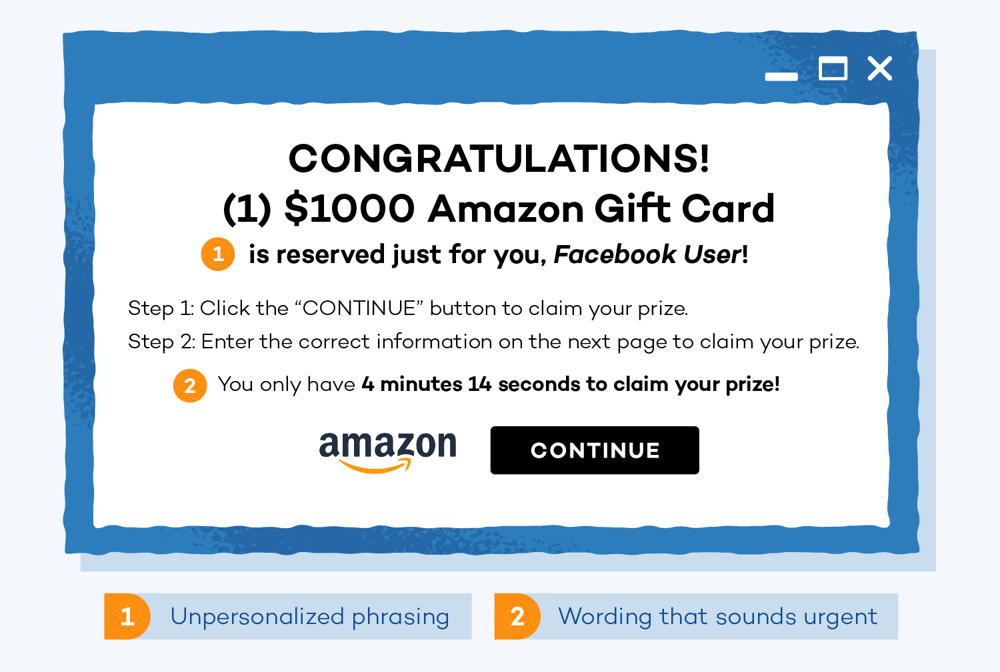

Fake Prizes
===========

In the era of massive heights of innovation and technology, scammers have found a way to scam many people by sending automatic emails with fake prizes to convince people they have won some reward only to scam them if they fall for it, which is very easy to do.

The Email
---------

The email is usually a clone site of 
a legitimate company that is made to convince you
of its legitimacy.

***common red flags***

* The add is urgent
* Fragment senteses
* Miss spellings

There are many different methods that these scams
get a hold of someone's information. Some information is fished if the receiver visited a sketchy site and used their email address.
in this was the scammers have your email to use as
a target for the fake prizes, and sometimes they use the user's last visit on the sketchy website to claim some trust.

the emails are also created by a generator that 
guesses random names and email combinations
twenty-four seven and sent to random people with
such emails around the world. [#f3]_

The Information
---------------

Within the email, multiple things make these scams work. They sometimes have their email, which was created to seem like the company they are posing as. If it is Walmart, their email may link to a page similar to the official Walmart page, phone number, a fake email, and more.

The email also contains information about the prize, usually a massive sum of money, gift cards, and even expensive jewelry or products of the sorts. They keep the emails fairy short, urging you to read them as people generally do not like reading long emails.

.. note:: Do not ignore anything that seems 
          suspicious, do an investigation before clicking a link or providing information on a website

***2020 Fake Prizes scams stats*** [#f5]_

+--------------------+---------------+
|Amount Lost         |Accused scamers|
+====================+===============+
|More than 1 billion |400            |
+--------------------+---------------+

Red Flags
---------

with fake prizes, the red flags can look very legit 
and lack of attention to detail can cost a lot of money only to receive nothing in return. The email usually does not have legitimate domain names and can be as simple as (amazon.service@gmail.com); this is a red flag because companies like amazon typically have the service after the (@) sign, and they do not use Gmail for their emails. More information on the topic is `here <https://www.consumer.ftc.gov/articles/0199-prize-scams>`_.

Things to look out for also include how you are told you are going to get your prize. The best situation is to avoid clicking the link in the first place, but if you happen to click it and you need to pay some fee to obtain your gift, there is a high chance that you are being scammed. It is easy to give up banking information with online businesses, especially if the prize is large, which it usually is. By giving out that information, they will obtain the information and steal money out of it, or they may get you addicted to spending by promising higher and higher prizes for extra fees. [#f2]_

Avoiding The Scams
------------------

Avoiding fake prize scams requires vigilance of what sites you are visiting. with the internet in our pockets, it is more than easy to be on the internet 
With the power for anyone to create a website, it is easy for any scammer to make fishing sites and scam people worldwide.

The other way to avoid these scams is to pay attention to emails, text messages, and ads. It is also essential to do a bit of background check on what companies or sites you are visiting and ensuring that you have done some homework before providing any information. [#f1]_

    Lottery and Free Gift Card Scam Example. [#f4]_

footer
------
.. [#f1] "`Fake Prizes <https://www.scamwatch.gov.au/types-of-scams/unexpected-winnings/unexpected-prize-lottery-scams"
.. [#f2] "`Sandra, Grauschopf / 12 warning Signs od Sweepstakes Scams <https://www.thebalanceeveryday.com/warning-signs-of-sweepstakes-scams-886996"
.. [#f3] "`Prize Scams <https://www.consumer.ftc.gov/articles/0199-prize-scams"
.. [#f4] "`Scam example <https://www.pandasecurity.com/en/mediacenter/panda-security/social-media-scams/"
.. [#f5] "`Stats <https://whnt.com/news/new-data-shows-80-of-money-lost-in-sweepstakes-lottery-and-prize-schemes-is-from-consumers-over-65/"