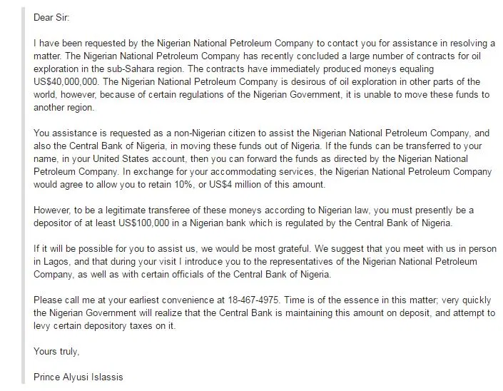

The Nigerian Prince
===================

Background
----------
Often when surfing through your email, you may discover numerous amounts of spam 
emails. Some of these emails may show up with particular sweepstakes promising 
chances to win a free cruise vacation or a sum amount of money! Many of these 
emails may seem friendly and harmless, but clicking on the link is when they get
you, especially from an unknown source. Sometimes these emails for sweepstakes 
may ask for private information such as your credit card information. It is 
essential to stay safe and only trust familiar emails you receive. 

Overview
--------
More often than not, many individuals may receive an email or letter from a 
mysterious individual overseas asking for you to share a large sum of money, 
promising they will pay you back in the future. These individuals may often 
develop a fake persona, such as a Nigerian Prince, therefore now being dubbed 
the *Nigerian Prince scam* or a sob story. Initially, these scams had originated 
from Nigeria, but over time, they have become abundant worldwide. [#f1]_

    Nigerian Prince scam example. [#f2]_

.. note::
    Why would a Nigerian King come to you for help? How did they find you?
    Ask these questions before acting.

Today these scams are not as obvious and outrageous claiming to be a King from
a distant country. These emails today may come from individuals impersonating
family members, friends, or co-workers. Often times these scam artists will
develop fake email accounts sharing similar addresses to your work, 
subscriptions, or even claiming to be an insurance company.

Despite the silliness of the situation or how absurd receiving this email may
be, many people around the world still fall for this scam. As seen in the
statistics below:

**2020 Nigerian Scam Statistics** [#f1]_

+------------+---------------+
|Amount Lost |# of Reports   |
+============+===============+
|$33,817     |476            |
+------------+---------------+

Tips
----
Luckily today, most email services do a great job filtering out emails and 
sorting them into your spam folder. In situations where the algorithm may 
fail, here are some tips to remain safe:

* Email is from an unknown source
* Filled with misspellings and grammatical errors
* **Does it sound too good to be true?**

Footer
------
.. [#f1] "`Nigerian Scams <https://www.scamwatch.gov.au/types-of-scams/unexpected-money/nigerian-scams>`_". Scam Watch, Australian Competition and Consumer Commission, 4 Jan. 2018.

.. [#f2] `Hamill, Jasper <https://www.thesun.co.uk/news/1539019/cops-arrest-nigerian-prince-behind-45million-worth-of-alleged-scams/>`_. “Cops Arrest 'Nigerian Prince' Alleged to Have Carried out £45million Email Scam Campaign.” The Sun, 2 Aug. 2016.