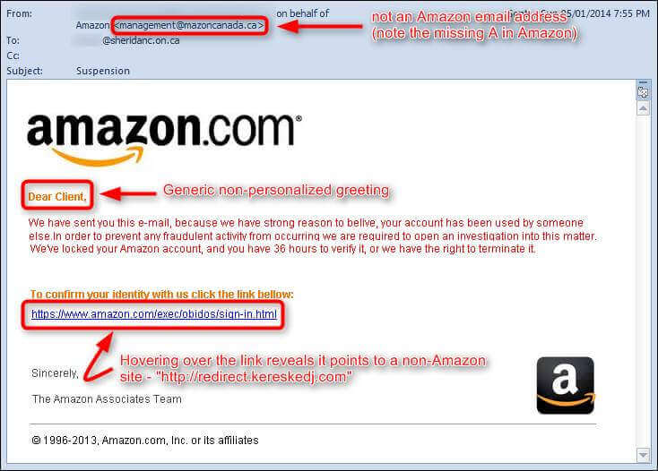

Phishing Scams
==============

*What Does a Phishing Attempt Look Like?*

Scammers will try to steal your passwords, Social Security numbers, and account numbers via email and text messages. Phishing emails will look like they are from a trusted source, such as a bank or a credit card comapny. These emails or texts will contain false information in an attempt to get you to click on a link. For example, it may claim that:
	
	* There is a problem with your account information
	* A suspicious log-in attempt
	* Claim that you are eligible for a refund

.. note::
	The One thing that these scammers cannot use while masquerading as a legit business is the official email of the company. If you want to make sure an email is a phishing attempt, check the email ID of the sender. You will also recognize a phishing scam if you find simple grammatical errors in the email.

*How Can I Protect Myself?*

Around 85% of organizations fall victim to phishing attacks, and almost 30% of phishing emails are opened by users. [#f2]_ Here is how you can protect yourself:

	#. Download a security software to protect your computer.
	#. Make sure you set the software on your phone to update automatically.
	#. **Use a two-step verification for your accounts.**
		* Fingerprint scan
		* Facial recognition 
	#. Back up your data on computer and phone.

Sometimes scammers outsmart your spam filters in your email, and phishing attempts find their way into your inbox, so it is still important to know this information. 

**The number one rule of online safety (and in life) is that if something is too good to be true, it probably is.**

+--------------------------------------------------+---------------------------------------------+
| Do                                               | Do Not                                      |         
+==================================================+=============================================+
| be careful of what information you share online  | click on anything in an unsolicited email   | 
+--------------------------------------------------+---------------------------------------------+
| report suspect email                             | send sensitive information via email or text|
+--------------------------------------------------+---------------------------------------------+

For more information on phishing, `click here <https://www.fbi.gov/scams-and-safety/common-scams-and-crimes/spoofing-and-phishing>`_ 

.. rubric:: Footnotes

.. [#f2] Gajjar, Mit. “Phishing Scams: 8 Helpful Tips to Keep You Safe.” About SSL Certificates, CheapSSLSecurity, 16 Sept. 2019, cheapsslsecurity.com/blog/phishing-scams-8-helpful-tips-to-keep-you-safe/. 

